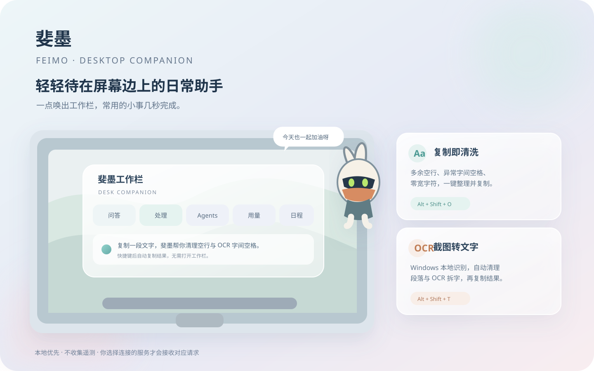
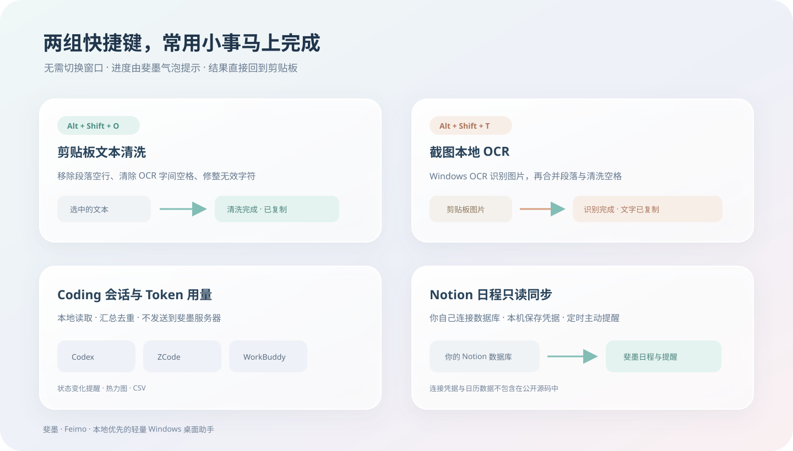
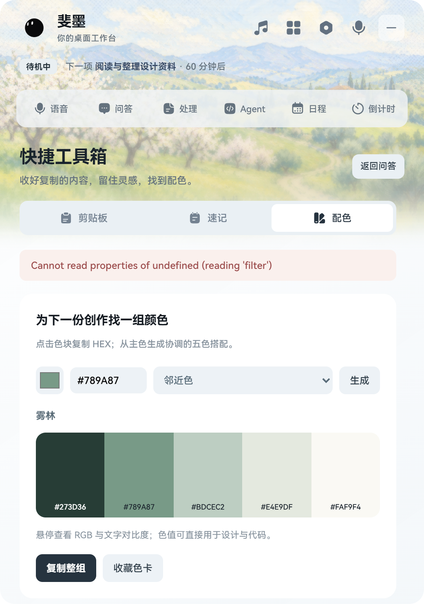
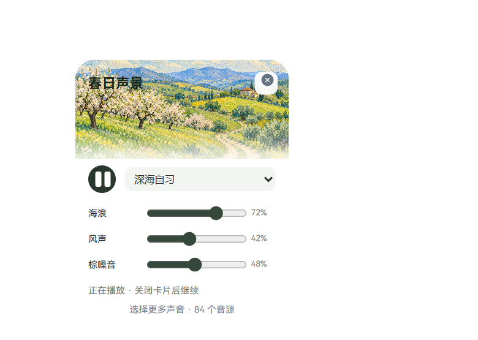
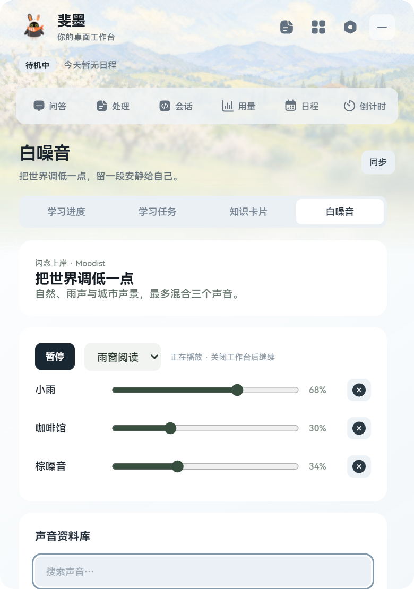

<div align="center">

# 斐墨 · Feimo

**A small desktop companion for quick everyday tasks.**

悬浮桌宠 · 快捷对话 · 倒计时 / 番茄钟 · 剪贴板速清 · 本地 OCR · Coding 会话提醒 · Token 用量 · Notion 日程 · 学习互联 · 白噪音

[Windows 发布页](https://github.com/fictivemotion/feimo-desktop-assistant/releases) · [功能介绍](#功能一览) · [隐私说明](docs/PRIVACY.md) · [发布记录](RELEASE_NOTES.md)

</div>



斐墨是一款轻量 Windows 桌面助手。桌面上保留一个可拖动、可贴边的小宠物；需要处理事情时，用全局快捷键或点击宠物唤起工作栏。它适合快速问答、清理复制文本、从截图提取文字、查看 Coding Agent 状态、浏览 Token 用量和接收日程提醒。

剪贴板默认只在主动操作时读取，可在工具箱中开启自动历史记录；Agent 监控和 Notion 日程同步均为只读。模型接口、API 密钥和 Notion 凭据由用户自行配置。

## 功能一览



| 功能 | 用法 |
| --- | --- |
| 桌面小宠物 | 伊埃斯、Forest Flow 或 Iridescent Opal；单击展开工作栏，拖动移动，靠近屏幕边缘时吸附 |
| 悬浮快捷区 | 悬停宠物出现底部提问框和弧形工具；提问结果从宠物气泡给出，可快速新建日程或计时 |
| 弧形工具翻页 | 五组、每组三个工具；在按钮上滚动鼠标或沿弧线拖动，工具依次沿弧线切换；方向键也可翻页 |
| 剪贴板管理 | 手动收录或可选自动记录文字与图片；搜索、固定、复制与删除；本机加密保存，常见密钥过滤 |
| 随手速记 | 助手旁快速写下想法；工作台提供检索、编辑、Markdown 预览、复制与导出 |
| 配色与色卡 | 六组精选搭配；从主色生成邻近、互补或三角色搭配，查看 RGB 和文字对比度，复制与收藏色值 |
| 主动提示卡片 | 日程和 Coding 状态卡片；Codex 额度达到 80% / 95% 提醒，也可从弧形工具查看最近记录 |
| 回复气泡组 | 提问后立即提示状态，逐步显示格式化回复；分段气泡保留，点击切换、翻页、复制或关闭 |
| 倒计时 / 番茄钟 | 自定分钟与彩色任务标签；番茄钟专注完成后进入 5 分钟短休息；工作栏保留记录、柱形趋势和年度热力图 |
| 快速文本清洗 | `Alt+Shift+O` 清理剪贴板文字并自动复制结果；支持删除段落空行、清除 OCR 字间空格、去除无效符号等 |
| 截图转文字 | `Alt+Shift+T` 识别剪贴板图片，在本机完成 OCR 与格式清洗，再把结果复制回剪贴板 |
| AI 问答与润色 | 配置 OpenAI 兼容服务后使用流式问答和显式触发的润色；可复制完整回答或纯文本 |
| Coding Agent 观察 | 只读观察本机 Codex、ZCode、WorkBuddy 的会话进度，提供状态变化提示 |
| 用量汇总 | 按工具和模型查看输入、输出与缓存 Token 用量，提供本地热力图与 CSV 导出 |
| 学习互联 | 可选连接闪念上岸账号；网站任务成为计时标签，共享开始、暂停、继续与结束；完成记录双端同步，离线补传，冲突显式处理 |
| 学习提示卡片 | 随机知识 / 错题卡、真实刷题正确率与考试倒计时；知识卡支持 Markdown、HTML 和数学公式，阅读不改变复习进度 |
| 白噪音声景 | 网站同源的 84 个声音、8 类音库、4 组预设，最多混合 3 个声音，各自调节音量；关掉编辑卡片仍可播放 |
| 日程提醒 | 记录本地日程；可选连接 Notion 数据库进行只读同步 |
| Windows 启动 | 在“设置 → Windows 启动”创建桌面快捷方式、开启或关闭开机自启动 |

更多细节见[隐私说明](docs/PRIVACY.md)和[发布记录](RELEASE_NOTES.md)。

### 工作台界面

统一的轻色卡片、清晰的标题与操作区。日程列表与新建表单、计时与统计分别展示；设置按任务分类。下面使用演示数据展示界面，不包含真实会话或凭据。




### 弧形工具分组

- 第 1 组：新建日程、倒计时 / 番茄钟、工作台。
- 第 2 组：剪贴板历史、快捷速记、配色。
- 第 3 组：图片提取、文字清洗、Codex 额度卡片。
- 第 4 组：白噪音小卡片、随机知识卡片、学习任务。
- 第 5 组：学习统计小卡片、计时统计、完整白噪音音库。

工作台右上角的工具箱按钮也可访问剪贴板、速记和配色。Codex 额度通过本机原生 CLI 的只读账户接口查询，启动和每分钟自动刷新，也可在用量页手动刷新；接口不可用时保留最近会话日志观测值，并标明来源、更新时间和错误。查询不创建会话或发起模型请求。用量模型名称来自回合上下文，支持 `gpt-6.1-sol` 等模型；历史 `unknown` 自动补全，未配置价格时不估算费用。

## 学习互联与白噪音

工作台右上角的文档图标打开「闪念上岸」。点击「登录网站并连接」，在独立、同屏置顶的登录窗口中登录自己的账号。服务端需要提供本项目所用的 `/api/v1/companion/` 接口；仅打开网站首页不会完成连接。

- **同一轮计时**：两端共享一个计时 ID；约每 3 秒同步，网页关闭后服务端仍按截止时间结算。番茄钟完成后进入短休息，休息不计入学习统计。
- **离线与冲突**：本机计时继续、完成记录等待补传；幂等操作避免重复统计。同时修改时提示选择网站或本机状态。断开前须完成待同步操作。
- **任务与知识**：可创建、完成网站任务，未完成任务成为倒计时标签；知识卡、刷题统计与考试计划约每 30 秒刷新。主动知识卡默认每 30 分钟，仅在白天使用电脑且没有问答、计时或打开工作台时显示。
- **白噪音**：无需登录即可使用在线音源；混音和音量保存在本机，播放状态不跨设备同步，避免两端同时自动播放。重启后保持暂停。



所有工作台模块共用春日田园油画与像素半调 Header：半透明白色毛玻璃遮罩增强文字可读性，2 / 6 / 14 px Progressive Blur 逐步模糊并渐隐到下方内容。白噪音页面与快捷卡片采用纯白背景；快捷卡片沿用 21 px 圆角，不添加外部阴影。音源目录共享自 Moodist，代码为 MIT，音频为 Pixabay / CC0，详见[素材说明](assets/soundscape/MOODIST-LICENSE.txt)。

完整视觉规则及接入示例见[斐墨通用 UI 设计规范](docs/斐墨-通用UI设计规范.md)。



## 快捷键

| 快捷键 | 操作 |
| --- | --- |
| `Alt+Shift+P` | 唤起 / 收起工作栏 |
| `Alt+Shift+T` | 剪贴板图片 → 本地 OCR → 清洗并复制文字 |
| `Alt+Shift+O` | 剪贴板文本 → 清洗并复制结果 |
| `Esc` | 收起工作栏 |

快捷键可在“设置 → 全局热键”中更改。若按键冲突，应用会显示注册失败的组合键。

## 下载与启动

1. 从 [GitHub Releases](https://github.com/fictivemotion/feimo-desktop-assistant/releases) 下载 Windows x64 安装程序或便携版。
2. 安装后启动“斐墨”。托盘菜单可打开设置、管理提醒或退出应用。
3. AI 服务和 Notion 日历是可选配置；不配置时，桌宠、文本清洗、本机 OCR、Agent 监控和本地用量仍可使用。

Releases 提供 Windows x64 NSIS 安装程序和便携版。当前发行包未进行代码签名，Windows SmartScreen 可能显示发布者未知。

## 从源码运行

要求：Windows 10/11 x64、Node.js 22 或更新的 LTS 版本、npm。

桌面形象可在设置中选择伊埃斯或两款 WebGPU 流体球。仓库和 Windows 发行包包含项目维护者独立绘制的伊埃斯同人复刻素材；这些素材单独采用 [CC BY-NC-SA 4.0 非商业许可](assets/pets/eous/LICENSE.txt)。伊埃斯及其原始角色设计的相关知识产权归米哈游 / HoYoverse 所有；此同人许可不授予底层角色或官方素材的权利。

Forest Flow 使用开源 [orb 项目](https://github.com/LerSent001/orb)的 Frost Flow 着色器流场并调整为森林色板；Iridescent Opal 使用该项目同名预设。两者保留完整 WebGPU/WGSL 渲染和状态过渡，见[第三方 MIT 许可](assets/orb/LICENSE)。流体球需要可用的 WebGPU 图形环境。斐墨源码按根目录 MIT 许可发布，不涵盖伊埃斯素材。

```powershell
npm ci
npm start
```

Windows 系统 OCR 通过 PowerShell 与 WinRT 调用，不需要额外下载 OCR 模型。要在 Windows 本机打包：

```powershell
npm ci
npm run dist:win
```

生成文件位于 `release/`。推送形如 `v1.0.1` 的版本标签后，GitHub Actions 会构建安装程序与便携版并创建 Release；发布流程见 [RELEASE.md](RELEASE.md)。

## 隐私与素材

- API 密钥和 Notion Token 只从设置中输入，并使用 Electron `safeStorage` 加密保存在本机用户数据目录。
- 剪贴板只在按下快捷键或主动使用处理页时读取；OCR 在 Windows 本机运行。
- Agent 会话日志和 Token 用量由本机读取与聚合，不会上传到斐墨服务。
- 倒计时标签、当前计时和历史记录保存在本机用户数据目录；重新启动可恢复未结束的计时。启用学习互联后，相关计时、任务操作会同步到用户连接的网站账号；账号会话和学习缓存以 Windows DPAPI 加密保存。
- 调用 AI 服务时，用户明确发送的文本会发往用户配置的模型服务商。
- 本仓库不包含真实日程、问答历史、API 密钥、Notion Token、本机截图或应用用户数据。
- 伊埃斯同人复刻素材随公开源码与发行包提供，并受独立的非商业许可约束；原角色及其 IP 仍归米哈游 / HoYoverse 所有。
- 两款流体球基于 MIT 授权的开源代码与预设，不包含其他第三方角色素材。

## 许可证

- 软件源码按 [MIT License](LICENSE) 授权。
- 伊埃斯同人素材按 [CC BY-NC-SA 4.0](assets/pets/eous/LICENSE.txt) 分享，仅限非商业用途。
- 流体球着色器与运行时代码按 [orb 项目的 MIT License](assets/orb/LICENSE) 使用。
- 界面图标采用 [Reicon Filled](https://github.com/dqev/reicon) 的 MIT 许可版本；所选图标已生成到 `renderer/shared/reicon-filled.js`，许可证见 [Reicon LICENSE](assets/icons/reicon/LICENSE)。
- 米哈游 / HoYoverse 的原角色、名称及相关权利不属于本项目许可范围；第三方依赖适用各自许可证。
