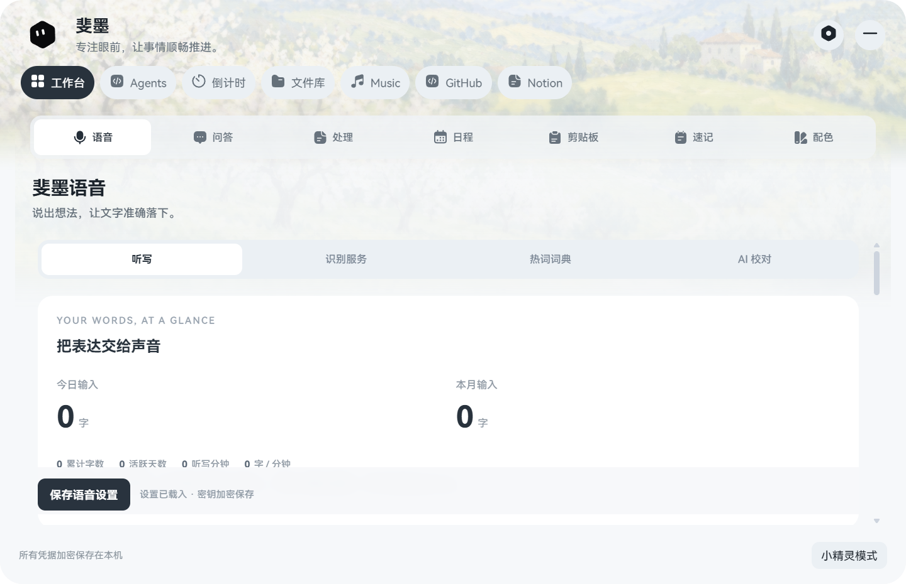
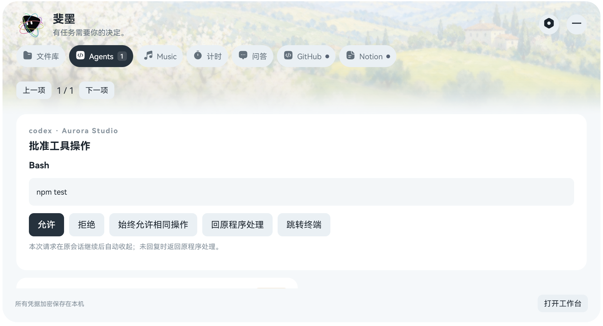
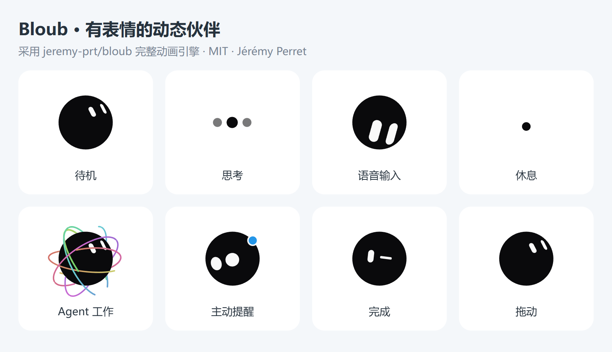

<div align="center">

# 斐墨 · Feimo

**A small desktop companion for quick everyday tasks.**

悬浮桌宠 · 语音输入与 AI 校对 · 快捷对话 · 倒计时 / 番茄钟 · 剪贴板速清 · 本地 OCR · Coding 会话提醒 · Token 用量 · Notion 日程 · 白噪音

[Windows 发布页](https://github.com/fictivemotion/feimo-desktop-assistant/releases) · [功能介绍](#功能一览) · [隐私说明](docs/PRIVACY.md) · [发布记录](RELEASE_NOTES.md)

</div>



斐墨是一款轻量 Windows 桌面助手。桌面上保留一个可拖动、可贴边的小宠物；需要处理事情时，用全局快捷键或点击宠物唤起工作栏。它适合快速问答、清理复制文本、从截图提取文字、查看 Coding Agent 状态、浏览 Token 用量和接收日程提醒。

剪贴板默认只在主动操作时读取，可在工具箱中开启自动历史记录；本地日志监控和 Notion 日程同步只读；可选会话桥接支持显式批准与回复。模型接口、API 密钥和 Notion 凭据由用户自行配置。

## 1.6.5 · 胶囊卡片与光感文件库

- 胶囊底部小箭头、向上拖动或向上滚动可手动隐藏；倒计时、音乐和白噪音继续运行。无持续状态时移出快捷区域或点击屏幕其他位置立即收起；鼠标重新到达顶部边缘唤出。
- 顶部快捷区加入问答。流式回答与主动提示从胶囊居中向下展开小卡片，保留完整文字；回答分段叠放，点击露出的卡片标题或使用上一段 / 下一段切换，支持复制全文。
- 文件库项目采用光感毛玻璃文件夹，悬停展开内页。点击进入项目，三列浏览、按名称 / 时间排序，保留检索、子文件夹与多选拖出。
- 拖入网址、网页超链接或 Windows `.url` 快捷方式可收藏并剪藏正文，生成可离线阅读的 HTML 快照，保留来源网址；剪藏内容可检索并用于 @ 文件问答。也可点击“收藏网址”输入链接。登录、脚本或访问限制导致无法读取时明确显示“仅收藏网址”，不会假称已剪藏正文。
- 文件类型图标使用 [Reicon Duotone Beta](https://reicon.dev/icon/document-text?weight=duotone) 的官方素材。网页正文提取采用 [Mozilla Readability](https://github.com/mozilla/readability)，不执行网页脚本、不读取浏览器登录信息。

## 顶部工作台与文件库（1.6.0）

在 **设置 → 顶部与服务连接** 选择小精灵或顶部模式。`Alt+Shift+I` 切换到顶部并展开 / 收起；工作台内也可切换。悬停胶囊时只显示可滚轮横向滚动的快捷药丸，支持计时、日程、白噪音、速记、剪贴板、配色、OCR 与清洗；点击右侧工作台按钮才展开完整界面。胶囊根据听写、批准请求、计时、音乐、Coding 和提醒显示对应状态及快捷操作。展开为长条圆角矩形，内部用纯白卡片承载单一任务，沿用油画像素半调、渐进模糊、HarmonyOS Sans 和 Reicon Filled。Bloub 在顶部药丸和展开区都使用完整动态引擎。


- **完整工作台：**一级倒计时、Agents 与文件库直接承载完整模块，内部 Dock 提供语音、问答、处理、日程、剪贴板、速记与配色；避免重复入口。语音、问答、处理、Agent、日程、倒计时 / 白噪音、文件库、工具箱和设置都在横向顶部窗口内使用，不另开竖向窗口。私人版学习空间也适配顶部；公开版继续排除学习空间。竖向工作台同样可管理全部服务与音乐。展开 / 收起固定内部布局，外壳连续变形，避免反复调整原生窗口尺寸；支持系统减少动态效果设置。
- **空闲收纳：**没有相关会话、音乐、计时、听写、待归档文件或新提醒时收为顶部小圆点；鼠标移到屏幕顶部中央边缘可唤出药丸。有活动时保留药丸，输入和待处理请求期间保持展开。
- **实时批准与回复：**在连接页预览并安装 Claude Code / Codex Hooks，保留其他配置并自动备份。新会话可在顶部或 Agent 页允许、拒绝、回答问题；记住的授权仅适用于同一项目、工具和完全相同输入，可撤销。请求失效或未回复时交回原程序。Codex 还需要在原程序 Hooks 页面信任配置；是否支持问题修改取决于客户端。日志观察模式仍只读，不伪装为审批通道。
- **终端定位：**桥接记录原进程的父进程链，定位原终端窗口；窗口已关闭或旧日志没有定位信息时明确提示。Windows Terminal 多标签页仅保证定位窗口，不承诺选中精确标签页。
- **服务卡片：**GitHub 展示开放 PR、请求审核和 CI；Notion 展示已授权的近期页面与数据源。Stripe 收款 / 余额、n8n 执行、Vercel 部署、Resend 投递、Cal.com 预约也提供独立配置和状态卡片。凭据本机加密存储；默认不连接，GitHub 可使用本机已登录 Git 凭据。卡片读取状态和跳转，不自动发邮件、付款或执行工作流。
- **网易云 Music：**优先读取 Windows 系统媒体会话；网易云 3.x 未提供媒体会话时兼容读取真实播放时钟、标题与音频状态。短歌词居中、长歌词完整滚动，快进和回退直接切换到当前句；底部进度条支持拖动与方向键调节，暂停与歌曲切换保持可用。兼容调节需要完整播放器窗口，会短暂显示播放器后恢复窗口与鼠标位置；无法识别的版本明确提示，可手动校准歌词。
- **问答：**顶部流式回答、Markdown 渲染、停止、新建对话和文字附件，与工作台共享历史。



### 文件归档

工作台 Dock 新增 **文件库**。可创建项目和项目内文件夹，将任意类型文件拖到顶部工作台或小精灵，或在文件库选择文件。

1. 原文件保留，副本暂存到本机文件库；一次最多 30 个文件，单文件最多 1 GB。
2. 复用已配置的官方 DeepSeek 密钥，使用 `deepseek-flash` 非思考模式分类。文本最多取 12,000 字符；PDF 前四页、DOCX 正文与图片本机 OCR 结果可参与分类。其他格式或超过内容提取大小限制时仅使用文件名与类型，仍允许保存。
3. 单文件找到已有项目 / 文件夹时自动复制归档；多文件作为一批统一识别，始终只显示一次位置选择；不确定时显示交互卡片，选择已有分类或填写项目 / 任务、文件夹名称。点击 **你来决定** 采用 AI 建议创建分类；接口失败时保留待归档副本供手动选择。
4. 支持检索文件名、项目和已提取正文；在问答输入框输入 `@` 搜索并选择最多六个归档文件，将正文片段作为模型上下文。勾选或 Ctrl / Shift 多选文件后，拖动已选文件行或“拖出所选”可一次复制多个原文件（最多 100 个）到支持系统文件拖放的程序（例如聊天附件区）；是否接受由目标程序决定，不自动发送消息。
5. 重名文件自动编号，不覆盖；待归档选择可在重启后恢复。保存后通知“XXX文件已经存到XXX位置啦👌”；点击文件定位到资源管理器。


文件库原件与索引保存在本机用户数据目录的“文件库”内，文件本身不是加密保险箱。拖入归档会把提取的内容片段 / 文件名发送到 DeepSeek，不发送完整二进制文件。不要拖入不希望发送给模型的资料。

顶部工作台与服务适配借鉴 [Coucou](https://github.com/Louis-CFM/coucou) 的 MIT 代码，保留[上游许可](assets/licenses/COUCOU-MIT.txt)。使用斐墨自有界面及 Bloub；不包含上游保留版权的 Mochi 角色、图标或音效。

## 功能一览



| 功能 | 用法 |
| --- | --- |
| 桌面小宠物 | 默认 Bloub，另可选伊埃斯、Forest Flow 或 Iridescent Opal；单击展开工作栏，拖动移动，靠近屏幕边缘时吸附 |
| 悬浮快捷区 | 悬停宠物出现底部提问框和弧形工具；提问结果从宠物气泡给出，可快速新建日程或计时 |
| 弧形工具翻页 | 五组、每组三个工具；在按钮上滚动鼠标或沿弧线拖动，工具依次沿弧线切换；方向键也可翻页 |
| 语音听写与热词 | `Ctrl+Alt+Space` 或自定义 `Ctrl+Alt` 开始 / 结束；波形胶囊、实时写入输入框、热词纠正、AI 校对和全文复制；Qwen 实时 / 本机离线 / CapsWriter / 兼容接口 |
| 语音输入统计 | 今日 / 月度 / 累计字数、活跃天数、时长与速度，7 / 30 日柱状图及年度热力图；仅本机聚合数据，不记录正文 |
| 剪贴板管理 | 手动收录或可选自动记录文字与图片；搜索、固定、复制与删除；本机加密保存，常见密钥过滤 |
| 随手速记 | 助手旁快速写下想法；工作台提供检索、编辑、Markdown 预览、复制与导出 |
| 配色与色卡 | 六组精选搭配；从主色生成邻近、互补或三角色搭配，查看 RGB 和文字对比度，复制与收藏色值 |
| 主动提示卡片 | 日程和 Coding 状态卡片；Codex 额度达到 80% / 95% 提醒，也可从弧形工具查看最近记录 |
| 回复气泡组 | 提问后立即提示状态，逐步显示格式化回复；分段气泡保留，点击切换、翻页、复制或关闭 |
| 倒计时 / 番茄钟 | 自定分钟与彩色任务标签；番茄钟专注完成后进入 5 分钟短休息；工作栏保留记录、柱形趋势和年度热力图 |
| 快速文本清洗 | `Alt+Shift+O` 清理剪贴板文字并自动复制结果；支持合并 OCR / PDF 错误换行、删除段落空行、清除 OCR 字间空格、去除无效符号等 |
| 截图转文字 | `Alt+Shift+T` 本地 OCR 识别剪贴板图片，识别正文交由 DeepSeek 清洗后自动复制；图片本身不上传 |
| AI 问答与润色 | 新建对话可清空旧上下文并停止旧回复；配置 OpenAI 兼容服务后使用流式问答和显式触发的润色；可复制完整回答或纯文本 |
| Coding Agent 观察 | 只读观察本机 Codex、ZCode、WorkBuddy 的会话进度，提供状态变化提示 |
| 用量汇总 | 按工具和模型查看输入、输出与缓存 Token 用量，提供本地热力图与 CSV 导出 |
| 白噪音声景 | Moodist 公开的 84 个声音、8 类音库、4 组预设，最多混合 3 个声音，各自调节音量；关掉编辑卡片仍可播放 |
| 日程提醒 | 记录本地日程；可选连接 Notion 数据库进行只读同步 |
| Windows 启动 | 在“设置 → Windows 启动”创建桌面快捷方式、开启或关闭开机自启动 |

更多细节见[隐私说明](docs/PRIVACY.md)和[发布记录](RELEASE_NOTES.md)。

### 工作台界面

统一的轻色卡片、清晰的标题与操作区。日程列表与新建表单、计时与统计分别展示；设置按任务分类。下面使用演示数据展示界面，不包含真实会话或凭据。


### 弧形工具分组

- 第 1 组：斐墨语音、热词词典、识别服务。
- 第 2 组：新建日程、倒计时 / 番茄钟、工作台。
- 第 3 组：剪贴板历史、快捷速记、配色。
- 第 4 组：图片提取、文字清洗、Codex 额度卡片。
- 第 5 组：白噪音小卡片、专注统计、完整白噪音音库。

工作台右上角的工具箱按钮也可访问剪贴板、速记和配色。Codex 额度通过本机原生 CLI 的只读账户接口查询，启动和每分钟自动刷新，也可在用量页手动刷新；接口不可用时保留最近会话日志观测值，并标明来源、更新时间和错误。查询不创建会话或发起模型请求。用量模型名称来自回合上下文，支持 `gpt-6.1-sol` 等模型；历史 `unknown` 自动补全，未配置价格时不估算费用。

## 语音输入与 AI 校对

点击 Dock 首项“语音”，配置识别和校对服务。选中其他程序中的输入位置，按 `Ctrl+Alt+Space`（可改为 `Ctrl+Alt`）听写，再按一次结束；在原文后追加新识别文字，只局部替换修订内容，自动复制最终正文。也可点击胶囊结束按钮，校对并复制完成后约 0.5 秒自动收起。可暂停、取消、自定义热词、导入词典及设定校对角色。未启动时不录音，不影响原有输入法。

在线实时识别支持 Qwen 最新 `qwen-audio-3.1-asr-flash-streaming`；DeepSeek V4.1 Flash 使用官方名称 `deepseek-flash` 并关闭思考。也支持按需下载约 237 MB 的本机双语流式模型，或连接 CapsWriter 服务。密钥由用户填写、DPAPI 加密，公开发行包不包含凭据。


完整用法、范围校验、故障处理及 CapsWriter 借鉴范围见[语音输入使用与技术说明](docs/斐墨-语音输入使用与技术说明.md)。

## 白噪音声景

打开“倒计时 → 白噪音”：它是“开始计时、统计记录”后的第三个子页签。工作台音乐按钮和弧形工具都可直接进入，弧形工具还提供独立混音小卡片。84 个声音、8 类音库、4 组预设，最多同时混合 3 个声音，分别调节音量。音源来自 Moodist 公开资源，无需登录；声音偏好保存在本机，重启后保持暂停。


所有工作台模块共用春日田园油画与像素半调 Header：半透明白色毛玻璃遮罩增强文字可读性，2 / 6 / 14 px Progressive Blur 逐步模糊并渐隐到下方内容。白噪音页面与快捷卡片采用纯白背景；快捷卡片沿用 21 px 圆角，不添加外部阴影。音源目录共享自 Moodist，代码为 MIT，音频为 Pixabay / CC0，详见[素材说明](assets/soundscape/MOODIST-LICENSE.txt)。

完整视觉规则及接入示例见[斐墨通用 UI 设计规范](docs/斐墨-通用UI设计规范.md)。


## 快捷键

| 快捷键 | 操作 |
| --- | --- |
| `Ctrl+Alt+Space` | 开始语音听写 / 结束并校对复制 |
| `Alt+Shift+P` | 唤起 / 收起工作栏 |
| `Alt+Shift+T` | 剪贴板图片 → 本地 OCR → 清洗并复制文字 |
| `Alt+Shift+O` | 剪贴板文本 → 清洗并复制结果 |
| `Esc` | 收起工作栏 |

快捷键可在“设置 → 全局热键”中更改。若按键冲突，应用会显示注册失败的组合键。

## 支持开发者

### 朕心甚悦，赏！

如果斐墨帮你省下了一点时间，欢迎请开发者喝杯茶。自愿赞赏，金额随心；软件的免费功能不受影响。设置 → 赞赏也能打开收款码大图。

<table><tr><th>支付宝</th><th>微信支付</th></tr><tr><td></td><td></td></tr></table>


## 下载与启动

1. 从 [GitHub Releases](https://github.com/fictivemotion/feimo-desktop-assistant/releases) 下载 Windows x64 安装程序或便携版。
2. 安装后启动“斐墨”。托盘菜单可打开设置、管理提醒或退出应用。
3. AI 清洗需在设置 → AI 文字清洗中填写 DeepSeek 密钥，也可复用已保存的官方 DeepSeek 语音校对 / 问答密钥。工作台点击“AI 快速清洗”后流式显示结果，可停止并恢复原文；图片识别后自动清洗。无 AI 配置时桌宠、本地 OCR、Agent 监控和本地用量仍可使用。

Releases 提供 Windows x64 NSIS 安装程序和便携版。当前发行包未进行代码签名，Windows SmartScreen 可能显示发布者未知。

## 公开版范围

本仓库及 1.5.0 起的新发行包提供通用桌面功能，不含维护者个人学习空间的源码、登录、同步接口和任务 / 知识卡片。公开版使用独立的本机用户数据目录，避免读取私人版配置。旧提交和旧发行包按维护者要求保留。

## 从源码运行

要求：Windows 10/11 x64、Node.js 22 或更新的 LTS 版本、npm。

桌面形象可在设置中选择伊埃斯、两款 WebGPU 流体球或 Bloub。仓库和 Windows 发行包包含项目维护者独立绘制的伊埃斯同人复刻素材；这些素材单独采用 [CC BY-NC-SA 4.0 非商业许可](assets/pets/eous/LICENSE.txt)。伊埃斯及其原始角色设计的相关知识产权归米哈游 / HoYoverse 所有；此同人许可不授予底层角色或官方素材的权利。

Forest Flow 使用开源 [orb 项目](https://github.com/LerSent001/orb)的 Frost Flow 着色器流场并调整为森林色板；Iridescent Opal 使用该项目同名预设。两者保留完整 WebGPU/WGSL 渲染和状态过渡，见[第三方 MIT 许可](assets/orb/LICENSE)。流体球需要可用的 WebGPU 图形环境。斐墨源码按根目录 MIT 许可发布，不涵盖伊埃斯素材。

```powershell
npm ci
npm start
```

Windows 系统 OCR 通过 PowerShell 与 WinRT 调用，不需要额外下载 OCR 模型。要在 Windows 本机打包：

```powershell
npm ci
npm run dist:win
```

生成文件位于 `release/`。推送形如 `v1.0.1` 的版本标签后，GitHub Actions 会构建安装程序与便携版并创建 Release；发布流程见 [RELEASE.md](RELEASE.md)。

## 隐私与素材

- API 密钥和 Notion Token 只从设置中输入，并使用 Electron `safeStorage` 加密保存在本机用户数据目录。
- 剪贴板只在按下快捷键或主动使用处理页时读取；OCR 在 Windows 本机运行。文字清洗和 OCR 后清洗会将正文发送到 DeepSeek，密钥在本机加密保存；请求失败或结果截断时不覆盖剪贴板。
- Agent 会话日志和 Token 用量由本机读取与聚合，不会上传到斐墨服务。
- 倒计时标签、当前计时和历史记录保存在本机用户数据目录；重新启动可恢复未结束的计时。
- 调用 AI 服务时，用户明确发送的文本会发往用户配置的模型服务商。
- 本仓库不包含真实日程、问答历史、API 密钥、Notion Token、本机截图或应用用户数据。
- 伊埃斯同人复刻素材随公开源码与发行包提供，并受独立的非商业许可约束；原角色及其 IP 仍归米哈游 / HoYoverse 所有。
- 两款流体球基于 MIT 授权的开源代码与预设，不包含其他第三方角色素材。

## 许可证

- 软件源码按 [MIT License](LICENSE) 授权。
- 伊埃斯同人素材按 [CC BY-NC-SA 4.0](assets/pets/eous/LICENSE.txt) 分享，仅限非商业用途。
- 流体球着色器与运行时代码按 [orb 项目的 MIT License](assets/orb/LICENSE) 使用。
- 界面图标采用 [Reicon Filled](https://github.com/dqev/reicon) 的 MIT 许可版本；所选图标已生成到 `renderer/shared/reicon-filled.js`，许可证见 [Reicon LICENSE](assets/icons/reicon/LICENSE)。
- 米哈游 / HoYoverse 的原角色、名称及相关权利不属于本项目许可范围；第三方依赖适用各自许可证。

语音功能借鉴 [CapsWriter-Offline](https://github.com/HaujetZhao/CapsWriter-Offline) 的框架、服务协议与音素匹配思路，保留[上游 MIT 声明](assets/licenses/CapsWriter-Offline-LICENSE.txt)。离线引擎和双语模型采用 Apache-2.0；中文拼音由 pinyin-pro 提供。具体适配范围见语音技术说明。

### 语音统计与 Bloub

Dock 首项为斐墨语音，Agent 页整合 Coding 会话与 Token 用量。语音胶囊使用蓝色渐变 Aura 边缘与校对文字 shimmer，固定在启动时所在屏幕的底部中央，只保留暂停、结束。`Ctrl+Alt` 配置后同时按下并松开切换录音；加按其他键不会触发。


Bloub 使用 [jeremy-prt/bloub](https://github.com/jeremy-prt/bloub) 的完整动画引擎，版权 © 2026 Jérémy Perret，MIT；固定源码、许可与构建说明见 [素材说明](assets/pets/bloub/SOURCE.md)。语音故障处理与数据口径见 [使用与技术说明](docs/斐墨-语音输入使用与技术说明.md)。

15 个原版状态均有实际情景触发：待机、问答等待、悬停问候、听写与流式回答、失败、日程卡片与会话更新、到时提醒、暂停与休息、启动唤醒、专注编辑、白噪音与逗宠、Coding 运行、完成、拖动、进入设置和快捷卡片。完整映射见使用说明；全部状态的视线统一朝左上方，待机及设置过渡保留左上范围内的轻微鼠标跟随，环绕与状态切换也保持这一方向。原版变形、眨眼、粒子和环绕动效保留；持续动作以自然过渡重播，动作重组完成后才回到低优先级场景。
