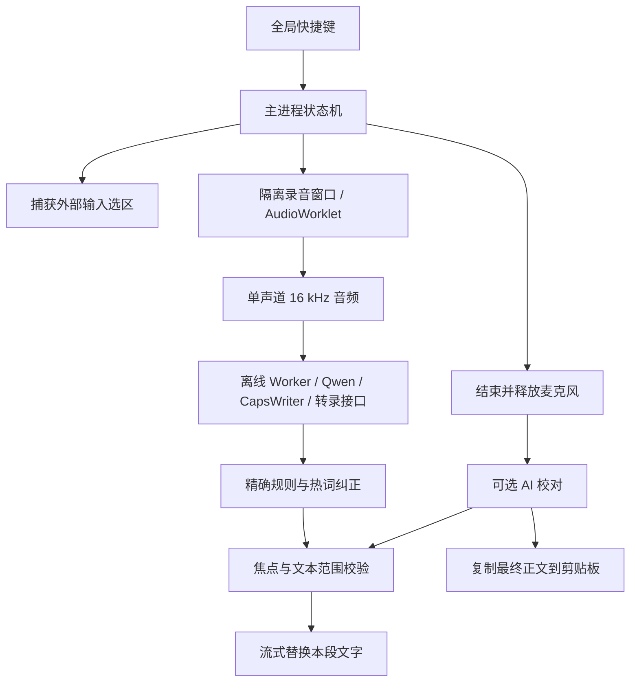

# 斐墨语音 · 使用与技术说明

文档编号：斐墨-语音输入使用与技术说明

项目名称：斐墨桌面助手

文档内容：语音输入、热词纠正与 AI 校对

生成日期：2026-09-30

版本：v01（应用 1.3.0）

## 开始使用

1. 点击工作台右上角的麦克风，打开「斐墨语音」。也可在弧形工具第一组进入语音设置。
2. 在「识别服务」选择 Qwen 在线实时识别、本机离线识别、CapsWriter 服务或兼容转录接口，保存设置。
3. 收起工作台，点击目标程序中可编辑的文本输入位置；选中的原文可被本次听写替换。
4. 按 **Ctrl + Alt + Space** 开始。助手附近出现波形胶囊，说话时识别文字逐步写入目标输入框。
5. 点击暂停按钮暂停音频送入；点击继续恢复。点击结束，或再次按快捷键，停止录音、校对本段文字、替换并复制全文。
6. 点击关闭按钮取消本次听写：已经写入的文字保留，不进行 AI 校对或自动复制。

未开启听写时，不录音、不注册键盘拦截、不更改系统输入法。语音快捷键在「听写」设置中修改；为了避免仅按修饰键干扰日常输入，必须包含一个普通键。组合键冲突会明确提示，保留原有有效配置。

### 服务选项

| 方式 | 说明 |
| --- | --- |
| Qwen 在线实时 | 默认模型名 `qwen-audio-3.1-asr-flash-streaming`，PCM 16 kHz 双向 WebSocket；支持对应地域 / 业务空间地址，热词发送到识别服务 |
| 本机离线 | sherpa-onnx 流式 Paraformer 中英双语；首次按需下载约 237 MB，之后不需要联网识别 |
| CapsWriter 服务 | 连接已启动的 CapsWriter-Offline 服务端，默认 `ws://127.0.0.1:6016`，无需启动它的键盘客户端；约 2 秒分段更新 |
| 兼容云端接口 | OpenAI 兼容 `/audio/transcriptions`，约 3 秒一段；实际更新速度依赖接口返回，不承诺逐字延迟 |

当前 Qwen 最新模型和接口以[官方模型列表](https://help.aliyun.com/zh/model-studio/asr-model)及[实时识别文档](https://help.aliyun.com/zh/model-studio/real-time-speech-recognition-user-guide)为准。支持旧版 `qwen3-asr-flash-realtime-2026-02-10` 的会话协议，选择该模型时自动使用 `/realtime` 路径。

AI 校对可沿用工作台问答模型，也可单独配置。DeepSeek V4.1 Flash 的接口模型名是 **`deepseek-flash`**，基础地址 `https://api.deepseek.com`；官方接口请求显式发送 `thinking: { type: "disabled" }`，使用流式响应收集完整校对正文。[模型发布说明](https://api-docs.deepseek.com/news/news260910/)、[思考模式开关](https://api-docs.deepseek.com/guides/thinking_mode/)。公开默认配置不包含用户凭据。

## 热词与角色

每行一个词，支持别名、上下文排除和中文同音 / 近音匹配：

```text
斐墨 | 翡墨 | 匪墨
伊埃斯 | 伊艾斯
CapsWriter | caps writer
斐墨 | 翡墨 ~~~ 翡翠
```

`~~~` 右侧的词出现在本次文本时，跳过该行纠正。匹配阈值越高越保守；英文名称使用准确别名，不做中文近音匹配。词典最多 500 行，可导入、导出 TXT，保存前可测试。

精确规则每行使用 `错词=正确词`，先于热词运行。本版不执行用户自定义正则表达式，避免不受控的匹配阻塞。使用「忠实校对」「简洁表达」「正式书面语」角色，或自定义提示词；默认只修正听写，保留原意与数字，不回答正文里的问题。

## 输入范围与故障处理

- Windows UI Automation 捕获焦点、选区、窗口身份、前后文；SendInput Unicode 只替换本次听写范围。不会全选整个输入框，不使用粘贴来显示临时识别文字。
- 每次写入前校验目标窗口、焦点、完整文本及光标；移动光标、切换窗口或手动编辑会停止自动替换。结束后仍保留识别结果并复制，供用户手动粘贴。
- 不支持密码、只读或无法安全定位的控件。启动前发现不支持时不录音，并提示更换输入框；部分编辑器、浏览器自定义控件、管理员权限应用可能无法写入。
- 没识别到文字时不删除选区，不覆盖剪贴板。AI 不可用时保留热词纠正后的听写原文，显示校对失败提示。
- 结束、取消、系统锁屏、休眠或退出均停止录音并释放引擎。单次上限 10 分钟、16,000 字。暂停不发送麦克风音频；长时间暂停若服务端断开会明确报错。
- 识别延迟由声学端点检测、网络、设备和服务决定。实时识别结果可能修订已经显示的文字，最终校对发生在结束之后。

## 架构与 CapsWriter 借鉴范围

研究版本：[CapsWriter-Offline](https://github.com/HaujetZhao/CapsWriter-Offline)，提交 `84912d5218ee5e51e216c54dc15a1cb0f466eb76`。采用其「录音客户端 → 分段 / 流式识别 → 热词纠正 → 外部输入 → LLM 校对」框架和 Float32 服务协议，中文纠正参考其音素窗口匹配思路并移植为 JavaScript。保留上游 MIT 声明。

斐墨加入独立波形窗口、按键切换状态机、单段安全替换与 DPAPI 凭据管理。不是运行完整的上游客户端：不启用按住录音、原始音频归档、剪贴板历史写入、上游自定义正则或自动键盘拦截。



### 模块职责

| 文件 | 职责 |
| --- | --- |
| `lib/voice/config.js` | 默认配置、协议与快捷键校验、输入大小限制 |
| `lib/voice/service.js` | 状态机、取消隔离、串行文字更新、结束校对与复制 |
| `lib/voice/qwen.js` | Qwen task-duplex 与 Realtime 两套协议、模型热词、修订句合并 |
| `lib/voice/asr.js` | 离线 Worker、CapsWriter、兼容接口以及 PCM / WAV 编码 |
| `lib/voice/recognizer-worker.js` | 仅听写时创建的 sherpa-onnx CPU 流式识别 |
| `lib/voice/models.js` | 固定版本模型下载、文件大小与 SHA-256 校验、取消 |
| `lib/voice/input-target.cs` | .NET UI Automation 定位、验证、Unicode 输入 |
| `renderer/voice/` | 按需麦克风、AudioWorklet、重采样、真实音量波形和控制胶囊 |
| `renderer/workbar/tabs/voice.js` | 听写、识别服务、热词、AI 校对四个单一任务页面 |

状态顺序：`idle → starting → listening ↔ paused → finishing → polishing → completed`；错误进入 `error`，取消回到 `idle`。会话 UUID 阻止旧识别 / AI 结果写入后续会话。录音窗口隔离权限，其他窗口不能提交音频。

## 数据与模型

录音和听写文本仅在当前进程内使用，不建立音频文件或听写历史。启动助手不会请求麦克风；录音窗口不获取外部输入框的前后文。校对只发送听写正文、词典和角色提示词，前后文留在本机定位助手中。

本机数据路径：`%APPDATA%\桌面宠物助手\`。语音设置写入普通设置文件，密钥分别以 `voiceAsrApiKey`、`voiceCapsApiKey`、`voiceLlmApiKey` 存入 DPAPI 加密的 `secrets.bin`，界面只显示是否已保存。离线模型在 `voice-models/paraformer-bilingual/`，定位助手在 `voice-input/`。不包含于公开仓库。

本地模型来自 [sherpa-onnx 双语 Paraformer](https://huggingface.co/csukuangfj/sherpa-onnx-streaming-paraformer-bilingual-zh-en)，固定 revision `8e40c43232a1c5c66c82111efc5820d3accca11b`；ONNX 下载验证预置 SHA-256，词表固定版本并记录摘要。模型和 sherpa-onnx 为 Apache-2.0，CapsWriter 为 MIT。安装包包含识别运行库，模型按需下载。

## UI 规范与验证

工作台遵循现有油画像素半调 Header、白色毛玻璃渐隐、Progressive Blur、HarmonyOS Sans、Reicon Filled 与统一圆角。胶囊无外部阴影，无灰色矩形底纹；与宠物、工作台和快捷工具避让，录音时暂时收起快捷工具与普通气泡。支持减少动效偏好。

已验证：96 项自动测试；真实 Windows 输入控件中选区流式替换、保留前后文、移动光标后阻止替换；离线识别合成语音；真实 Qwen 3.1 实时识别 + DeepSeek Flash 非思考校对；380 / 420 / 520 px 工作台四子页布局。所有语音测试使用虚构的合成录音，没有采集真实麦克风；测试剪贴板使用替身，未覆盖用户剪贴板。


